# 🌌 Sydematic's Portfolio Showcase

Welcome to **Sydematic’s Portfolio Showcase** — an interactive journey through my creative world of tech, film, music, math and beyond.  
Each section highlights a unique aspect of who I am, what I build, and what inspires me.  


## 📸 Screenshots by Page

### 🌌 Universe
This section serves as the **central hub**, connecting everything in the portfolio.  
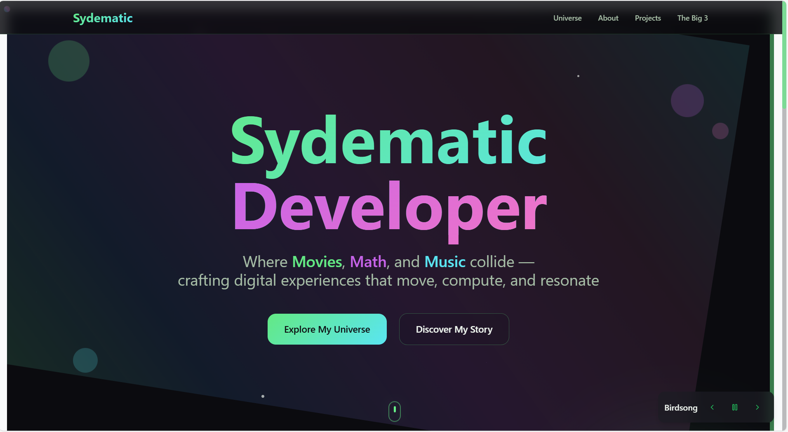

---

### 🧑 About
Get to know me — background, passions, and what drives my work.  
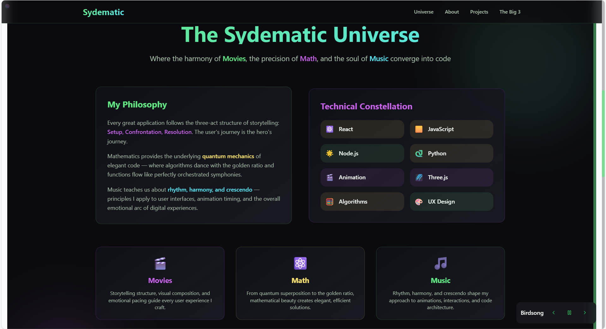

---

### 💻 Projects
Showcase of my coding, tech builds, and creative experiments.  
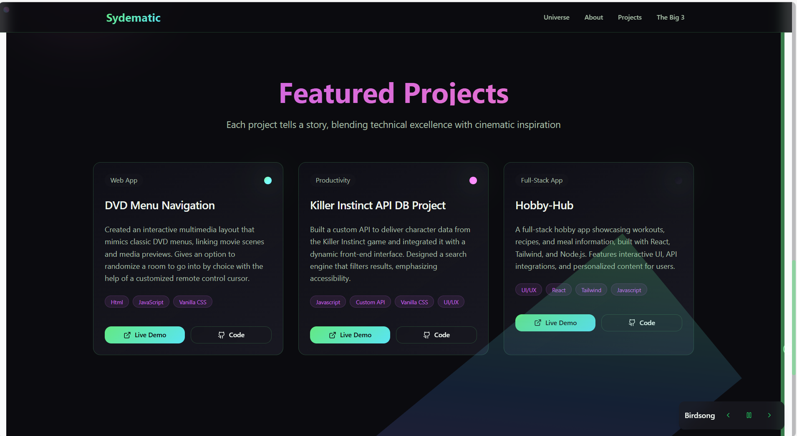

---

### 🌟 The Big 3
A deep-dive into my **three core influences** that shaped my journey.  
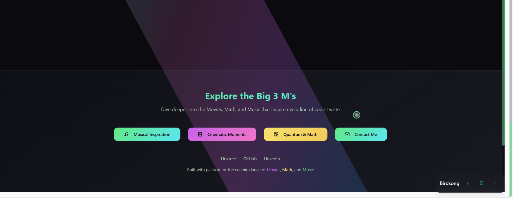

---

### 🎶 Musical Inspiration
Highlighting the soundtracks, artists, and compositions that fuel my creativity.  
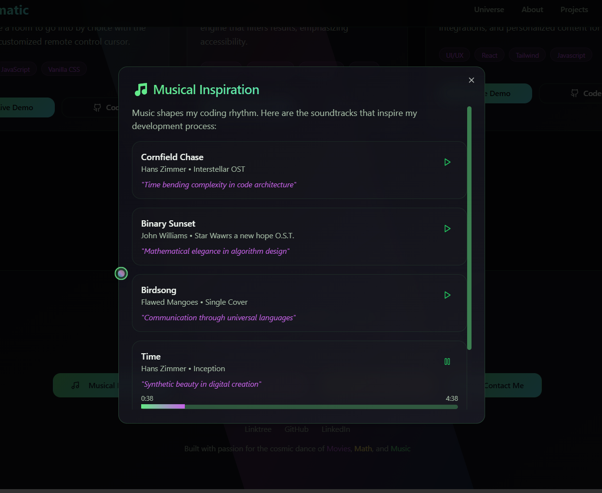

---

### 🎬 Cinematic Moments
Film stills, references, and impactful cinematic experiences that inspire my storytelling.  
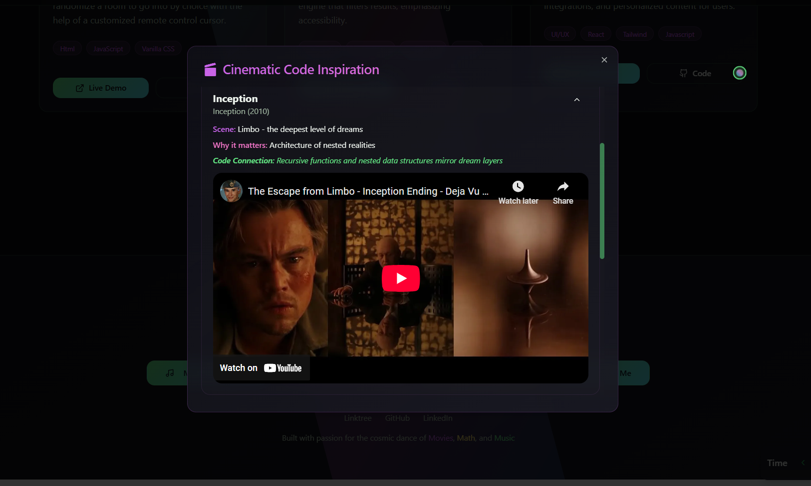

---

### 🧮 Quantum & Math
Exploring patterns, equations, and the beauty of logic in creativity.  
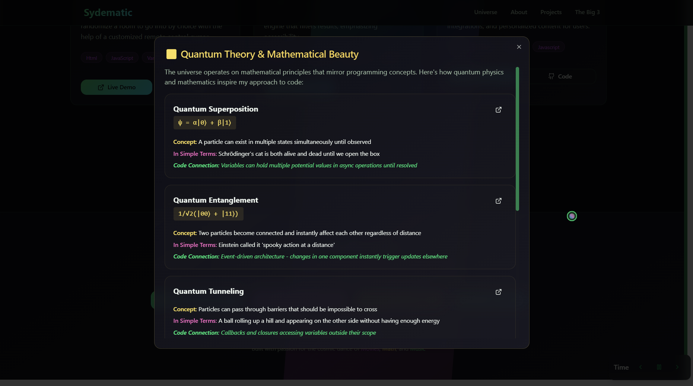

---

### 📩 Contact Us
A way to reach out, collaborate, or just say hi. In this section I was able to create
a custom response to real users and receive a notification as well showing they reached out!  
<p align="center">
  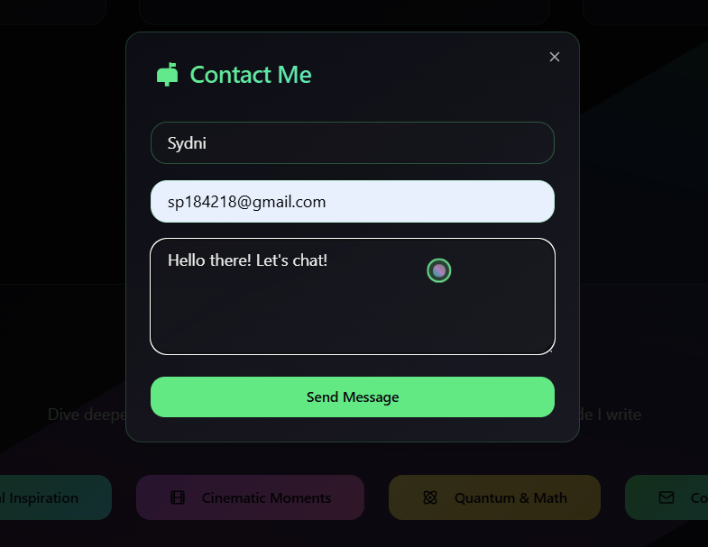
  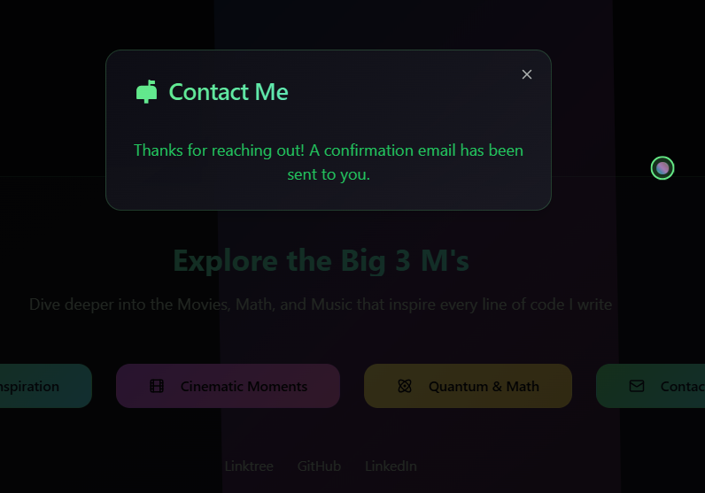
   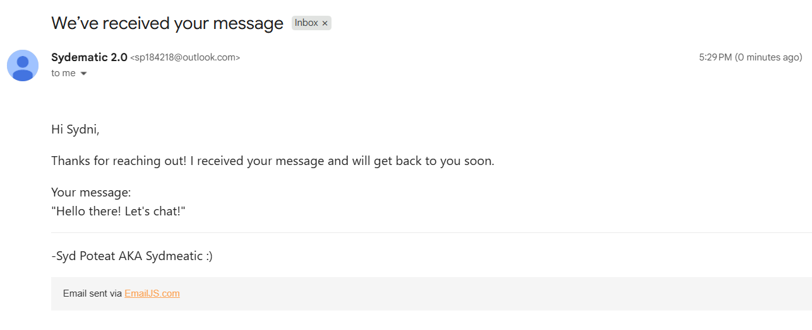
    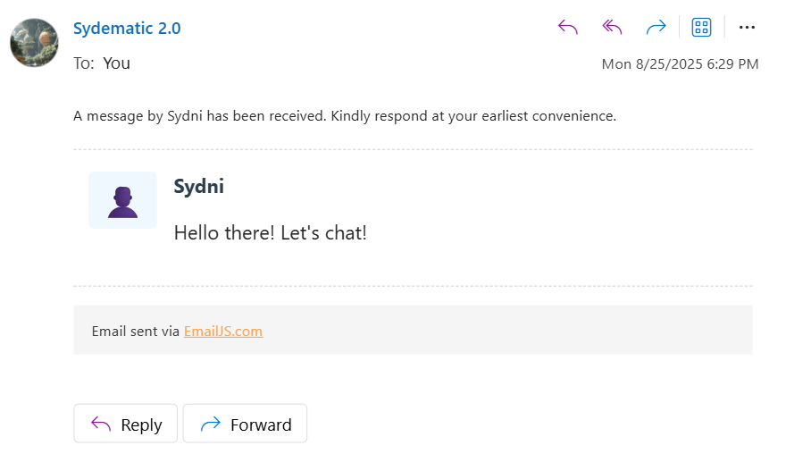
</p>

---

### 📱 Mobile Layout
There is also a nice clean mobile feature to view the project as well!

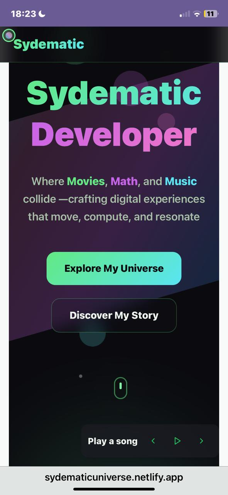

---

## 🚀 Tech Stack

- HTML5  
- CSS3  
- JavaScript (Vanilla)  
- Git & GitHub  

---

## 🔧 How to Run Locally

```bash
git clone https://github.com/Sydematic/Sydematic-Universe.git
cd Sydematic-Developer
# Open index.html in your browser

## 🚀 Tech Stack
- Vite
- JavaScript
- React
- Animation
- Tailwind CSS
- UI/UX
- With the help of Lovable providing a nice template to work on.
Due to time constraints, Lovable managed to help with getting the
UI files done in a timely manner, while it was in tsx, I managed to
translate it to jsx with some cool ai tools while being able to focus
on javascript and styling much easier and less hassle. 


💡 Notes

Best viewed on desktop, but can be viewed very well on mobile too!!
 [🌌 Visit Sydematic Universe](https://sydematicuniverse.netlify.app/#hero)


🧑‍💻 Author
Sydni Poteat. aka Sydematic
